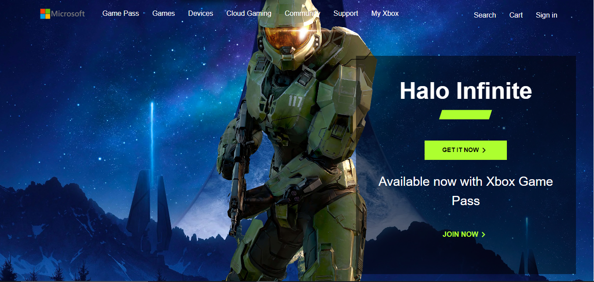
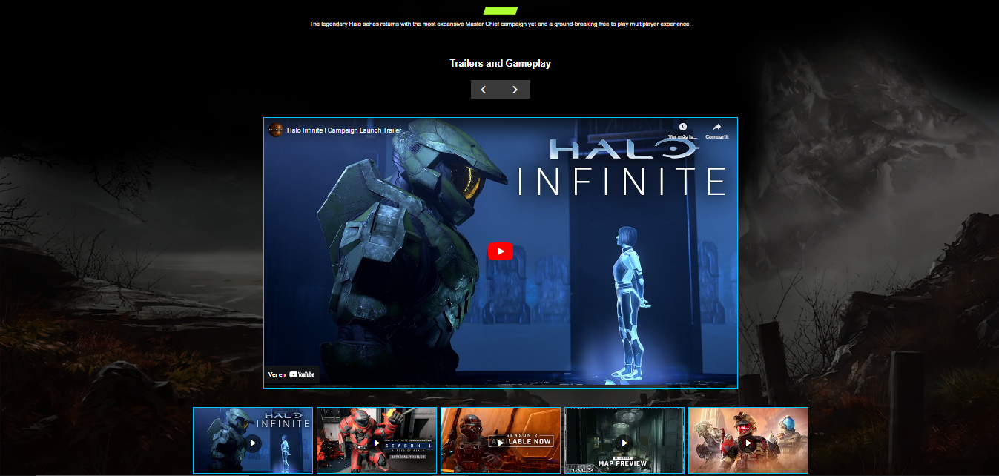
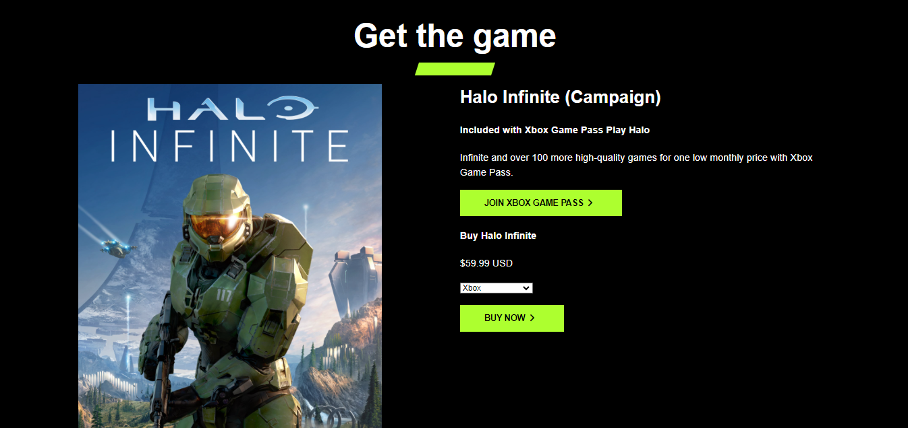
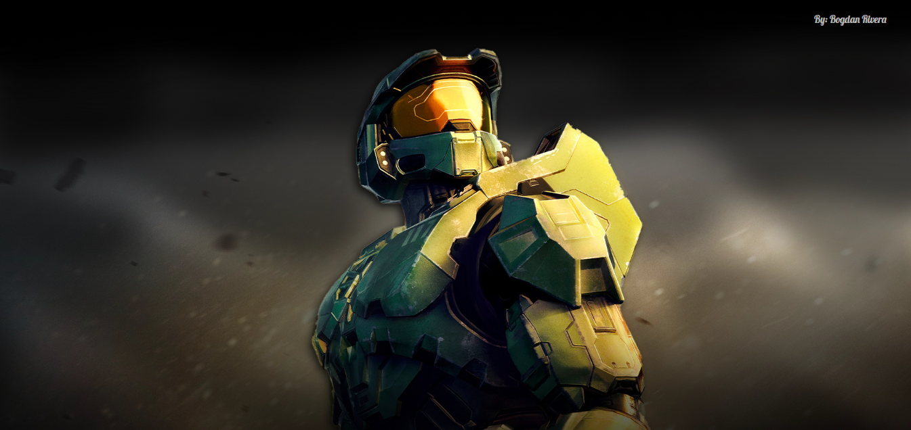
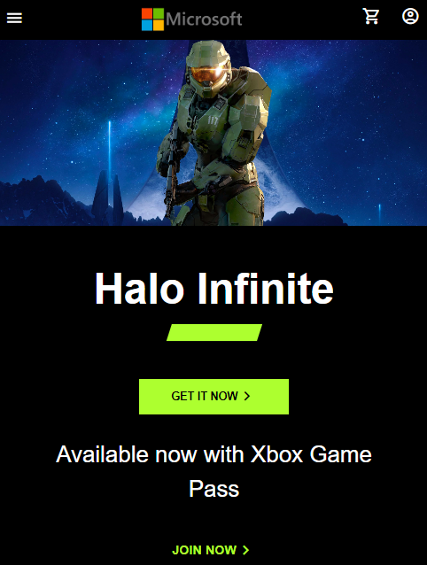
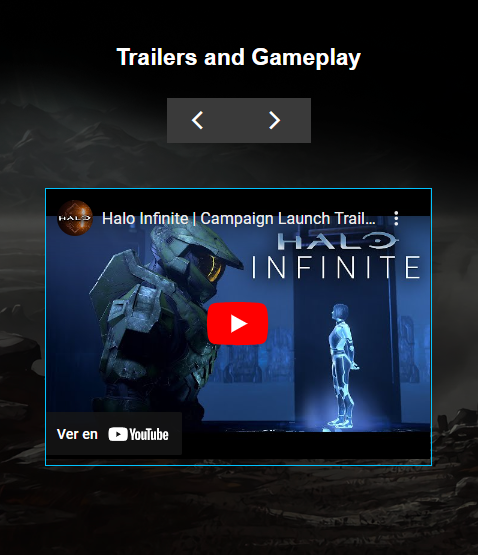
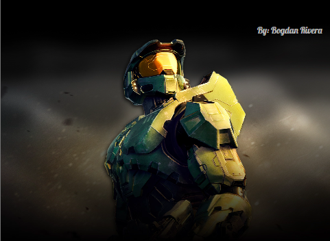

<h1 align="center"> Halo Website Replica </h1>


<p align="center">
  
</p>

   <p align="center">
   
   </p>


This project is a faithful replica of the Microsoft Halo webpage, meticulously crafted using HTML, CSS, and JavaScript for an immersive user experience. The primary focus of this project lies in frontend development, paying homage to one of the all-time favorite video games.

# Screenshots
## Computer version: 






## Mobile version: 






# Installation
Follow these steps to install and run the project locally. Make sure you have Node.js installed.

### Clone this repository:
```
git clone https://github.com/BogdanRivera/front-end-halo-infinite-web.git
```
### Install dependencies:
```
cd src
npm install
```
### Start the application:
```
npm run dev
```


## Contributions

Contributions are welcome. If you want to improve or add new features, follow these steps:

1. Fork the repository
2. Create a branch for your feature: git checkout -b feature/NewFeature
3. Commit your changes: git commit -m 'Add new feature'
4. Push your changes to the branch: git push origin feature/NewFeature
5. Open a pull request on GitHub

## Contact
For questions or suggestions, feel free to reach out to me via bogdanrivera@gmail.com.

